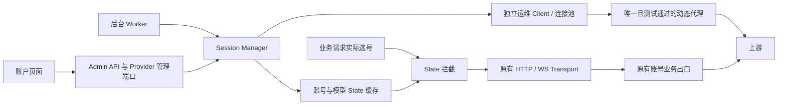

# 会话保活与 State 热更新

该能力的全局开关和账号开关均默认关闭。管理员在设置页确认账户异常、限流和调用消耗风险并保存，再逐账号选择重写模型。后台和账户页面均可刷新所选模型的 State；业务请求只读取对应账号、对应模型的有效缓存。启用不要求先证明故障由 State 引起。

## 1. 适用边界

这是显式启用的实验性跨轮次覆盖策略，不替代 OAuth Token 刷新、额度管理或现有重试机制，不保证消除限流。

已核验官方 Codex 源码提交 [`3d3ae4965ab370217e871b3a7f0d15589557ee4b`](https://github.com/openai/codex/blob/3d3ae4965ab370217e871b3a7f0d15589557ee4b/codex-rs/core/src/client.rs#L269-L296)：`ModelClientSession` 每轮独立创建，State 在同一轮次内保持不变，并明确要求 “must not send it between different turns”。本功能按用户指定的账号＋模型粒度覆盖，与该版本官方合同存在已知偏离；管理员通过账号开关选择使用。真实业务中的兼容性留待部署验证，不以该源码版本代表用户实际上游。

每个账号可选择 1～32 个模型，默认 `gpt-5.6-sol` 和 `gpt-6-astra`，可从现有账户模型目录勾选，也可手动添加其他上游模型 ID。已选模型从可添加目录中排除，取消选择后可重新添加；目录与手动输入均按完整 ID 去重。模型名区分大小写、不自动映射，必须精确匹配业务请求最终使用的上游模型。默认名称仅是初始值，应按实际模型目录调整。

60 分钟是本地缓存 TTL，不是上游承诺的有效期。重写属于真实模型调用，可能占用同一账号额度并产生费用。

## 2. 模块与网络隔离

核心文件为 `backend/crates/providers/openai/src/session_manager/manager.rs`。Provider Bundle 构造一个共享 `Arc<SessionManager>`，自动 Worker、Admin 管理端口和业务请求拦截共用它。Core 不依赖具体 Provider 或 HTTP。



运维 Client 单独构造，显式禁用环境代理，再绑定代理管理中的唯一动态代理；全局未开启、没有动态代理或测试未通过时拒绝重写，禁止回退直连或业务出口。该 Client 按要求忽略 TLS 证书校验、禁止重定向，连接超时 10 秒、总请求超时 30 秒。忽略证书校验仅作用于运维链路，因此代理及其网络须处于可信运维边界。

业务拦截位于 Provider 实际选号和既有账号状态隔离之后，仅修改 State，不接收、不替换业务 Client，也不执行网络刷新。应用层分别使用连接池和代理配置；物理出口是否独立，由部署网络保证并在真实环境确认。

## 3. 配置与缓存

| 配置 | 存储与 API | 默认与更新语义 |
| --- | --- | --- |
| `session_keepalive_enabled: bool` | 全局运行设置；API `sessionKeepaliveEnabled` | 默认 false；提交 true 时必须携带 `sessionKeepaliveRiskConfirmed: true`，并存在测试通过的动态代理 |
| `is_dynamic: bool` | 代理目录；API `isDynamic` | 默认 false；全系统仅一个动态代理，不允许任何账号以 ID、URL 或导入方式绑定为业务出口 |
| `enable_session_keepalive: bool` | 账号；API `enableSessionKeepalive` | 默认 false；省略或 null 保留，false 显式关闭 |
| `session_keepalive_models: Vec<String>` | 账号；API `sessionKeepaliveModels` | 默认两个模型；1～32 个不重复 ID，每个 1～128 字节，无首尾空白或控制字符；省略或 null 保留 |

迁移 `0017_session_keepalive_controls.sql` 增加全局开关、模型选择和代理角色。迁移后全局仍关闭，需要在代理管理中重新保存并测试动态代理，再确认风险启用。旧 `oamProxy` 原值保留供回退和兼容读取，但不再生效；非空写入返回错误。代理必须经过统一 URL 规范化，避免复制旧的未规范化地址而绕过业务绑定隔离。

迁移 `0018_session_rewrite_model_ids.sql` 将旧名称 `5.6 sol`、`6`、`gpt-6` 修正为完整 ID，保留其他自定义模型，并合并转换后重复的选择。

代理地址变化会清除测试结果。启用检查与代理变更在事务中串行化；运行时每次发送与写回均检查当前动态代理是否仍有效。普通代理测试沿用原有诊断语义，只有动态代理把测试成功作为重写准入条件。

缓存采用 Tokio `RwLock<HashMap<...>>`，进程内共享，不落盘。外层按账号分区，内层 Key 为 `"{account_id}:{model_name}"`，值包含：

```rust
struct SessionState {
    state_value: String,
    expire_at: i64, // Unix 秒；等于当前时间即失效。
}
```

缓存条目额外记录凭据 revision 和单调时钟截止时间。不同账号、不同模型绝不借用 State；每个账号最多 32 个条目。State 不实现 Debug 或管理接口序列化。

进程重启后缓存为空。账号配置变更通知会使本账号缓存失效；凭据 revision 在读写时核对。失效时移除账号缓存代次，旧重写即使返回成功也不能填回新代次。Worker 定期清理不再符合条件的账号；过期值不会注入，之后由成功刷新替换。

## 4. 心跳重写与重试

共用刷新入口读取当前账号凭据与运维代理；仅接受已启用、开关开启、凭据 Ready 且未过期的 OpenAI OAuth 账号，并遵守账号模型访问限制。

每个模型发送独立 `POST /codex/responses`，复用现有账户连接测试的 Generate 请求构造、HTTP Header 与 zstd 编码，携带当前真实 Token 和账号 installation ID。每次输入为 `hi`，`store: false`、`stream: true`。请求仅通过独立运维 Client 发送。

HTTP 成功响应中必须存在非空、长度不超过 8192 的合法 `x-codex-turn-state`，并在最多 64 KiB 的 SSE 中观察到 `response.completed` 才缓存。HTTP 错误、超时、缺失 Header、失败/不完整事件和截断流均不写入。复用已有 State Header 解析与 Retry-After 解析。

单个模型失败后最多尝试 3 次，间隔为 1 秒、2 秒加少量随机抖动；429 优先遵守 `Retry-After`，未提供时冷却 60 秒。若要求等待超过 30 秒，本轮停止并返回等待时间，后续模型和重复点击不能绕过冷却；不会在后台创建无限重试任务。重试前重新检查账号资格、凭据版本、所选模型和动态代理。配置变化直接停止；最终失败不覆盖旧 State。重写不冒充业务请求记入用户用量账单。

## 5. 后台调度

Worker 以 `openai-session-keepalive` 向 Host 注册，复用监督与取消机制。启动后执行一轮，再在每轮结束均匀抽取闭区间 `3000..=3480` 秒休眠，取消可中止执行或休眠。

每轮顺序处理符合条件的账号，每个账号顺序处理所有勾选模型。手动和自动刷新共用账号互斥锁，全局最多同时刷新两个账号；忙时明确返回冲突，不创建无界等待队列。

每个模型独立成功后设置 `expire_at = now + 3600`。失败保留尚有效的旧 State，不延长 TTL，也不覆盖其他模型的缓存。写入前再次检查账号资格、凭据 revision、模型权限、代理配置和缓存代次，避免配置变更后的迟到结果回填。

首轮无额外启动抖动；轮间 jitter 不保证多副本启动错峰。本项目仍按单进程、单副本运行。若账号很多，整轮耗时加休眠可超过 TTL，早期条目将失效并回退原有业务处理。

## 6. 业务请求拦截

实际选定账号后，只有全局与账号开关均开启、账号符合资格、最终上游模型精确匹配、缓存未过期且凭据 revision 一致时才覆盖 State。

HTTP 使用 `x-codex-turn-state`；WS 同时更新逐帧 `client_metadata["x-codex-turn-state"]`，已有连接通过每帧 metadata 携带更新。清除请求中旧的同名 passthrough Header，保留其他 metadata。开关关闭、不支持的模型或缓存未命中时，沿用既有处理。

注入后的请求始终由原有账号业务 Transport 发送。心跳代理不进入业务 Client 构建或缓存。

关闭全局开关会通过配置快照停止新业务请求的 State 覆盖，并停止后续重写。关闭账号开关使对应缓存失效。删除、修改动态代理或测试失败会阻止后续重写和迟到写回，但已有有效缓存仍保留至原到期时间；需要立即停止覆盖应关闭全局或账号开关。已经发出的请求无法撤回。

## 7. API、账户页面与诊断

完整 wire 合同见 [API 文档](api.md#会话-state-刷新)。设置页提供默认关闭的全局开关和风险确认弹窗；代理页面以“动态代理”标记唯一重写出口，保存后自动测试。账号编辑页为 OpenAI OAuth 账号提供开关及模型选择，默认使用该动态代理，无需逐账号绑定。

开启后，账户操作菜单展示“刷新 State”。点击立即刷新该账号所有所选模型，不等待后台周期，不重置 Worker 的周期。账号禁用时按钮不可用；代理缺失、凭据不可用等由服务端校验并返回明确提示。

弹窗分别显示每个模型的结果、刷新时间和本地到期时间，支持部分成功、再次刷新；刷新中禁用关闭与重复提交。各模型顺序执行，包含自动重试；模型数量多时耗时会增加，部署入口需要匹配管理请求超时。只返回时间、模型和脱敏错误，不返回 State、Token 或代理认证。

设置、账号与代理变更沿用现有事务、审计和配置发布。手动与后台刷新使用相同 `session_keepalive` 日志，记录账号、模型、重写 ID、尝试次数、代理脱敏地址、请求方法/路径、请求 Header 和正文、HTTP 状态、响应 Header、完整 SSE JSON 字段、用量、State、耗时、截断与流错误，以及最终缓存写回结果。HTTP 错误通过重写 ID 与日志关联。

日志按管理员要求保留 State 原文；Authorization、Cookie、代理密码、Token 等认证字段递归脱敏，已知鉴权值在字符串中同样替换。响应采集上限为 64 KiB；未完成的帧和无法结构化解析的内容仅记录遗漏数及字节数，避免截断认证字段后泄漏。日志不是完整无限制抓包，应限制日志访问和保留周期，排障时不要把真实 State 或认证资料放入提交、截图和公开报告。管理刷新 API 不返回 State 原文。

## 8. 实施与交接

源码基线为 v3.10.0（`3328a4356a4f1d2c448e5e16ab5e120f37498999`）。五个步骤及手动刷新已接入，实际验证证据、运行条件与真实业务待验收项见 [交接文档](session-keepalive-handoff.md)。
