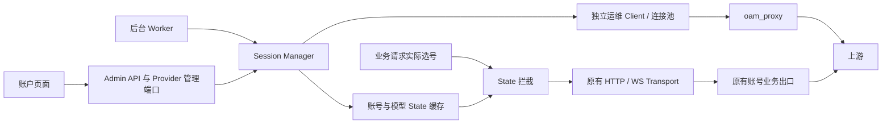

# 会话保活与 State 热更新

该能力由管理员逐账号手动开启，默认关闭。开启后，后台和账户页面均可刷新该账号两个指定模型的 State；业务请求只读取对应账号、对应模型的有效缓存。启用不要求先证明故障由 State 引起。

## 1. 适用边界

这是显式启用的实验性跨轮次覆盖策略，不替代 OAuth Token 刷新、额度管理或现有重试机制，不保证消除限流。

已核验官方 Codex 源码提交 [`3d3ae4965ab370217e871b3a7f0d15589557ee4b`](https://github.com/openai/codex/blob/3d3ae4965ab370217e871b3a7f0d15589557ee4b/codex-rs/core/src/client.rs#L269-L296)：`ModelClientSession` 每轮独立创建，State 在同一轮次内保持不变，并明确要求 “must not send it between different turns”。本功能按用户指定的账号＋模型粒度覆盖，与该版本官方合同存在已知偏离；管理员通过账号开关选择使用。真实业务中的兼容性留待部署验证，不以该源码版本代表用户实际上游。

模型严格为 `5.6 sol` 和 `6`，不 trim、不转换大小写、不自行替换为定价表中的 `gpt-5.6-sol`、`gpt-6-astra`。拦截时匹配最终上游模型；全局模型映射若将名称改为其他值，将不会命中。真实账号是否接受这两个字面模型名需实际验证。

60 分钟是本地缓存 TTL，不是上游承诺的有效期。探活属于真实模型调用，可能占用同一账号额度并产生费用。

## 2. 模块与网络隔离

核心文件为 `backend/crates/providers/openai/src/session_manager.rs`。Provider Bundle 构造一个共享 `Arc<SessionManager>`，自动 Worker、Admin 管理端口和业务请求拦截共用它。Core 不依赖具体 Provider 或 HTTP。



运维 Client 单独构造，显式禁用环境代理，再绑定 `oam_proxy`；没有代理时拒绝探活，禁止回退直连或业务出口。该 Client 按要求忽略 TLS 证书校验、禁止重定向，连接超时 10 秒、总请求超时 30 秒。忽略证书校验仅作用于运维链路，因此代理及其网络须处于可信运维边界。

业务拦截位于 Provider 实际选号和既有账号状态隔离之后，仅修改 State，不接收、不替换业务 Client，也不执行网络刷新。应用层分别使用连接池和代理配置；物理出口是否独立，由部署网络保证并在真实环境确认。

## 3. Step 1：配置与缓存

| 配置 | 存储与 API | 默认与更新语义 |
| --- | --- | --- |
| `oam_proxy: String` | PostgreSQL 全局运行设置；API `oamProxy` | 默认空；省略或 null 保留，空字符串停止新探活，非空按已有代理 URL 规则校验 |
| `enable_session_keepalive: bool` | PostgreSQL 账号列；API `enableSessionKeepalive` | 新建与存量账号默认 false；更新时省略或 null 保留，false 显式关闭 |

新增迁移 `0016_session_keepalive.sql`，登记 `.frozen-sha256`；既有迁移不修改。Store 的查询、映射、账号事务与设置事务贯通新增字段。管理端设置通过现有 revision 发布生效，不增加另一份启动 YAML 配置。

缓存采用 Tokio `RwLock<HashMap<...>>`，进程内共享，不落盘。外层按账号分区，内层 Key 为 `"{account_id}:{model_name}"`，值包含：

```rust
struct SessionState {
    state_value: String,
    expire_at: i64, // Unix 秒；等于当前时间即失效。
}
```

缓存条目额外记录凭据 revision 和单调时钟截止时间。不同账号、不同模型绝不借用 State；每个账号最多两个条目。State 不实现 Debug 或管理接口序列化。

进程重启后缓存为空。账号配置变更通知会使本账号缓存失效；凭据 revision 在读写时核对。失效时移除账号缓存代次，旧探活即使返回成功也不能填回新代次。Worker 定期清理不再符合条件的账号；过期值不会注入，之后由成功刷新替换。

## 4. Step 2：心跳探活

共用刷新入口读取当前账号凭据与运维代理；仅接受已启用、开关开启、凭据 Ready 且未过期的 OpenAI OAuth 账号，并遵守账号模型访问限制。

每个模型发送独立 `POST /codex/responses`，沿用已有 Codex 身份 Header 构造及账号 installation ID，携带当前真实 Token。请求包含目标模型、轻量输入 `hi`、`store: false`、`stream: true` 和空工具列表。

HTTP 成功响应中必须存在非空、长度不超过 8192 的合法 `x-codex-turn-state`，并在最多 64 KiB 的 SSE 中观察到 `response.completed` 才缓存。HTTP 错误、超时、缺失 Header、失败/不完整事件和截断流均不写入。复用已有 State Header 解析与 Retry-After 解析。

429 设置账号探活冷却，后续模型与重复点击尊重冷却，不能立即重试。日志仅记录脱敏结果及可取得的数值用量；未知用量不记为零。探活不冒充业务请求记入用户用量账单。

## 5. Step 3：后台调度

Worker 以 `openai-session-keepalive` 向 Host 注册，复用监督与取消机制。启动后执行一轮，再在每轮结束均匀抽取闭区间 `3000..=3480` 秒休眠，取消可中止执行或休眠。

每轮顺序处理符合条件的账号，每个账号顺序处理两个模型。手动和自动刷新共用账号互斥锁，全局最多同时刷新两个账号；忙时明确返回冲突，不创建无界等待队列。

每个模型独立成功后设置 `expire_at = now + 3600`。失败保留尚有效的旧 State，不延长 TTL，也不影响另一个模型。写入前再次检查账号资格、凭据 revision、模型权限、代理配置和缓存代次，避免配置变更后的迟到结果回填。

首轮无额外启动抖动；轮间 jitter 不保证多副本启动错峰。本项目仍按单进程、单副本运行。若账号很多，整轮耗时加休眠可超过 TTL，早期条目将失效并回退原有业务处理。

## 6. Step 4：业务请求拦截

实际选定账号后，只有开关开启、账号符合资格、最终上游模型精确匹配、缓存未过期且凭据 revision 一致时才覆盖 State。

HTTP 使用 `x-codex-turn-state`；WS 同时更新逐帧 `client_metadata["x-codex-turn-state"]`，已有连接通过每帧 metadata 携带更新。清除请求中旧的同名 passthrough Header，保留其他 metadata。开关关闭、不支持的模型或缓存未命中时，沿用既有处理。

注入后的请求始终由原有账号业务 Transport 发送。心跳代理不进入业务 Client 构建或缓存。

清空或修改 `oamProxy` 会影响后续探活，并拒绝配置已变化的在途结果；不会立即撤回已有有效 State。需要立即停止覆盖时，关闭对应账号开关。已经发出的业务请求无法撤回。

## 7. Step 5：API 与账户页面

完整 wire 合同见 [API 文档](api.md#会话-state-刷新)。设置页提供密码样式的 `oamProxy` 输入框；账号编辑页为 OpenAI OAuth 账号提供保活开关。

开启后，账户操作菜单展示“刷新 State”。点击立即刷新该账号两个模型，不等待后台周期，不重置 Worker 的周期。账号禁用时按钮不可用；代理缺失、凭据不可用等由服务端校验并返回明确提示。

弹窗分别显示每个模型的结果、刷新时间和本地到期时间，支持部分成功、再次刷新；刷新中禁用关闭与重复提交。只返回时间、模型和脱敏错误，不返回 State、Token 或代理认证。

设置与账号配置沿用现有事务、审计字段名和配置发布；手动刷新本身只更新内存并记录运维日志，不新增持久审计事件。读取 `oamProxy` 的管理员接口返回原值供编辑，响应 `no-store`；Debug、审计和错误不输出代理认证。数据库及备份中仍包含该配置，应按现有敏感管理配置保护。业务传输已有的显式 `request_dump` 会保留完整 Header/正文，也可能包含注入后的 State；普通脱敏诊断与运维日志不输出 State，验收时不要开启原始转储或分享其文件。

## 8. 实施与交接

源码基线为 v3.10.0（`3328a4356a4f1d2c448e5e16ab5e120f37498999`）。五个步骤及手动刷新已接入，实际验证证据、运行条件与真实业务待验收项见 [交接文档](session-keepalive-handoff.md)。
