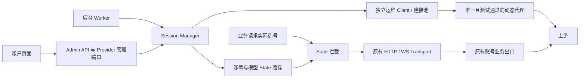

# State 重写与热更新

该能力的全局开关和账号开关均默认关闭。管理员在设置页确认账户异常、限流和调用消耗风险并保存，再逐账号选择重写模型。后台和账户页面均可刷新所选模型的 State；业务请求只读取对应账号、对应模型的有效缓存。启用不要求先证明故障由 State 引起。

## 1. 适用边界

这是显式启用的实验性跨轮次覆盖策略，不替代 OAuth Token 刷新、额度管理或现有重试机制，不保证消除限流。

已核验官方 Codex 源码提交 [`3d3ae4965ab370217e871b3a7f0d15589557ee4b`](https://github.com/openai/codex/blob/3d3ae4965ab370217e871b3a7f0d15589557ee4b/codex-rs/core/src/client.rs#L269-L296)：`ModelClientSession` 每轮独立创建，State 在同一轮次内保持不变，并明确要求 “must not send it between different turns”。本功能按用户指定的账号＋模型粒度覆盖，与该版本官方合同存在已知偏离；管理员通过账号开关选择使用。真实业务中的兼容性留待部署验证，不以该源码版本代表用户实际上游。

每个账号可选择 1～32 个模型，默认 `gpt-5.6-sol` 和 `gpt-6-astra`，可从现有账户模型目录勾选，也可手动添加其他上游模型 ID。已选模型从可添加目录中排除，取消选择后可重新添加；目录与手动输入均按完整 ID 去重。模型名区分大小写、不自动映射，必须精确匹配业务请求最终使用的上游模型。默认名称仅是初始值，应按实际模型目录调整。

60 分钟是网关缓存 TTL，不是上游承诺的有效期。重写属于真实模型调用，可能占用同一账号额度并产生费用。

## 2. 模块与网络隔离

核心文件为 `backend/crates/providers/openai/src/session_manager/manager.rs`。Provider Bundle 构造一个共享 `Arc<SessionManager>`，自动 Worker、Admin 管理端口和业务请求拦截共用它。Core 不依赖具体 Provider 或 HTTP。

运维 Client 单独构造，显式禁用环境代理，再绑定代理管理中的唯一动态代理；全局未开启、没有动态代理或测试未通过时拒绝重写，禁止回退直连或业务出口。该 Client 按要求忽略 TLS 证书校验、禁止重定向，连接超时 10 秒、总请求超时 30 秒。忽略证书校验仅作用于运维链路，因此代理及其网络须处于可信运维边界。

业务拦截位于 Provider 实际选号和既有账号状态隔离之后，仅修改 State，不接收、不替换业务 Client，也不执行网络刷新。应用层分别使用连接池和代理配置；物理出口是否独立，由部署网络保证并在真实环境确认。

## 3. 配置与缓存

| 配置 | 存储与 API | 默认与更新语义 |
| --- | --- | --- |
| `session_keepalive_enabled: bool` | 全局运行设置；API `sessionKeepaliveEnabled` | 默认 false；提交 true 时必须携带 `sessionKeepaliveRiskConfirmed: true`，并存在测试通过的动态代理 |
| `session_rewrite_concurrency: u32` | 全局运行设置；API `sessionRewriteConcurrency` | 默认 3，范围 1～10；省略或 null 保留 |
| `session_rewrite_retry_interval_seconds: u32` | 全局运行设置；API `sessionRewriteRetryIntervalSeconds` | 默认 6 秒，范围 1～300；省略或 null 保留 |
| `is_dynamic: bool` | 代理目录；API `isDynamic` | 默认 false；全系统仅一个动态代理，不允许任何账号以 ID、URL 或导入方式绑定为业务出口 |
| `enable_session_keepalive: bool` | 账号；API `enableSessionKeepalive` | 默认 false；省略或 null 保留，false 显式关闭 |
| `session_keepalive_models: Vec<String>` | 账号；API `sessionKeepaliveModels` | 默认两个模型；1～32 个不重复 ID，每个 1～128 字节，无首尾空白或控制字符；省略或 null 保留 |

迁移 `0017_session_rewrite_retry_policy.sql` 为已有运行配置增加并发与间隔字段，不修改开关及账号选择。

迁移 `0016_session_keepalive.sql` 增加全局与账号开关、模型选择和代理角色，默认模型为 `gpt-5.6-sol`、`gpt-6-astra`。迁移后全局仍关闭，需要在代理管理中保存并测试动态代理，再确认风险启用。代理必须经过统一 URL 规范化，避免复制未经规范化的地址而绕过业务绑定隔离。

代理地址变化会清除测试结果。启用检查与代理变更在事务中串行化；运行时每次发送与写回均检查当前动态代理是否仍有效。普通代理测试沿用原有诊断语义，只有动态代理把测试成功作为重写准入条件。

票据通过 Core 的 `ProviderSessionTicketPort` 存入 Redis，按账号与模型隔离，记录 State、凭据 revision 和绝对过期时间。Redis Hash 使用最晚票据期限过期；各模型读取时独立校验期限，读取和重启不续期。票据不实现 Debug，不进入管理接口或账号导出。

网关进程重启后可以继续读取 Redis 中未过期且 revision 一致的票据。账号配置变更会清除本账号 Redis 票据并推进本地刷新代次，保留刷新互斥和上游冷却；旧代次请求被取消，写入与失效串行化。Redis 不可用时不回退到本地票据，不报告写入成功，也不允许受管理的账号／模型裸发业务请求。

## 4. 心跳重写与重试

共用刷新入口读取当前账号凭据与运维代理；仅接受已启用、开关开启、凭据 Ready 且未过期的 OpenAI OAuth 账号，并遵守账号模型访问限制。

每个模型发送独立 `POST /codex/responses`，复用现有账户连接测试的 Generate 请求构造、HTTP Header 与 zstd 编码，携带当前真实 Token 和账号 installation ID。每次输入为 `hi`，`store: false`、`stream: true`。请求仅通过独立运维 Client 发送，强制 HTTP/1.1、禁用连接池复用，并发送 `Connection: close`，每个探针重新建立代理连接。实际出口 IP 是否变化仍取决于代理池策略。

仅接受 HTTP 200、原始 Header 长度精确 292 字节且具有 `gAAAAA` 前缀的 ASCII `x-codex-turn-state`。长度不符立即返回错误，不复制凭证、不读取响应体、不写缓存；合法 Header 到达后也立即关闭响应，不等待 SSE 完成。长度与前缀是业务准入规则，不代表密码学完整性或模型质量验证。

429 设置当前账号、当前模型的探活冷却，跨刷新取消与缓存失效保留；未提供 Retry-After 时冷却 60 秒。同一模型收到多个冷却时保留最长截止时间；后续轮次跳过仍冷却的模型，其他模型继续。重写不冒充业务请求记入用户用量账单。

## 5. 后台调度

Worker 以 `openai-session-keepalive` 向 Host 注册，启动后立即扫描，再在每轮全部探测结束后等待配置间隔（默认 6 秒）。票据 TTL 为 3600 秒，只有缺票、过期或剩余不足 600 秒的模型参与刷新；其余成功项跳过，不发探针。手动刷新遵循同样规则。

每个账号／模型的前三个探测轮次固定为单探针，轮后固定等待 6 秒；第四轮起使用全局配置并发（1～10，默认 3）。重试间隔可配置为 1～300 秒，默认 6 秒；在全局「State 重写」开关旁保存，第 4 轮起使用配置间隔，每轮读取新值，已发出的请求和已开始的等待不被修改打断。同一模型一轮使用 `select_ok` 首个成功结果，立即取消剩余请求，写入 Redis 后向手动刷新页面通知成功；成功项退出本次刷新。

后台每账号一轮只执行一批探针，失败交给下一次扫描，不在某个账号内无限等待；账号间有界并发，手动与后台共用账号互斥锁，全局最多两个账号同时刷新。手动刷新持续执行剩余模型的轮次，直至成功、配置失效或调用取消。取消会丢弃完整 future 树，没有脱离父调用的探针任务。

每次成功写入的绝对期限为 `now + 3600`。失败保留未过期旧票据，不延长 TTL。发送探针与写入前检查账号资格、实际鉴权绑定、模型权限、动态代理和缓存代次。成功写入失败时不向页面报告成功。

票据绑定实际 Access Token、上游账号身份和安装身份的摘要，不绑定 Cookie 或通用 CAS 版本。Cookie 更新、账号名称和调度设置修改不清票、不延长 TTL；真实鉴权材料变化后旧票据不可用，探测期间发生此类变化也拒绝写回。旧格式 Redis 票据没有摘要，仅在原凭据版本仍匹配时复用，否则重新探测。

本项目仍按单进程、单副本运行，Redis 恢复不代表跨副本探测去重。大规模账号扫描可能延迟临期刷新；到期后对应账号／模型按 fail-closed 暂停调度，不会使用过期票据。

## 6. 业务请求拦截

实际选定账号后，只有全局与账号开关均开启、账号符合资格、最终上游模型精确匹配、缓存未过期且实际鉴权绑定一致时才覆盖 State。

HTTP 使用 `x-codex-turn-state`；WS 同时更新逐帧 `client_metadata["x-codex-turn-state"]`，已有连接通过每帧 metadata 携带更新。清除请求中旧的同名 passthrough Header，保留其他 metadata。全局或账号开关关闭、未选中的模型沿用既有处理。功能开启时默认 fail-closed：选号阶段排除缺少有效票据的账号／模型，发送前再次读取校验；Redis 不可用、过期或实际鉴权绑定不符时均不发出该业务请求，有其他合格账号则继续选号。

注入后的请求始终由原有账号业务 Transport 发送。心跳代理不进入业务 Client 构建或缓存。

关闭全局开关会通过配置快照停止新业务请求的 State 覆盖，并停止后续重写。关闭账号重写开关会停止对应覆盖与刷新，已保存票据保留至原到期时间；禁用或删除账号则取消探测并清票。删除、修改动态代理或测试失败会阻止后续重写和迟到写回，但已有有效缓存仍保留至原到期时间；需要立即停止覆盖应关闭全局或账号开关。已经发出的请求无法撤回。

## 7. API、账户页面与诊断

完整 wire 合同见 [API 文档](api.md#会话-state-刷新)。设置页提供默认关闭的全局开关和风险确认弹窗；代理页面以“动态代理”标记唯一重写出口，保存后自动测试。账号编辑页为 OpenAI OAuth 账号提供开关及模型选择，默认使用该动态代理，无需逐账号绑定。

开启后，账户操作菜单展示“刷新 State”。点击立即检查该账号所有所选模型，跳过尚未临期的有效票据，不等待后台周期，不重置 Worker 的周期。账号禁用时按钮不可用；代理缺失、凭据不可用等由服务端校验并返回明确提示。

弹窗通过 POST SSE 逐模型接收结果，缓存写入成功后立即显示“刷新成功”、刷新时间和票据到期时间；其余模型继续显示刷新中并自动重试。刷新中禁止重复提交，但允许“停止刷新”或关闭弹窗；取消连接会中止未完成模型，保留已成功结果与缓存。连接中断或后续错误不会把成功模型改成失败。全部完成或停止后可再次刷新；页面卸载时取消连接，不自动重连。只返回时间、模型和脱敏错误，不返回 State、Token 或代理认证。

设置、账号与代理变更沿用现有事务、审计和配置发布。手动与后台刷新使用相同 `session_keepalive` 日志，记录账号、模型、重写 ID、尝试次数、代理脱敏地址、请求方法/路径、请求 Header 和正文、HTTP 状态、响应 Header、State、耗时，以及最终缓存写回结果。HTTP 错误通过重写 ID 与日志关联。票据缺失、过期、鉴权不符或缓存读取失败会记录脱敏原因；选号因缺票排除账号时记录 `account.session_state` 请求事件。长度校验失败时记录 `invalid_state` 和实际长度，立即丢弃响应，不采集凭证与正文。

日志按管理员要求保留 State 原文；Authorization、Cookie、代理密码、Token 等认证字段递归脱敏，已知鉴权值在字符串中同样替换。探测不采集响应正文。日志不是完整无限制抓包，应限制日志访问和保留周期，排障时不要把真实 State 或认证资料放入提交、截图和公开报告。管理刷新 API 不返回 State 原文。

## 8. 实施与交接

源码基线为 v3.10.0（`3328a4356a4f1d2c448e5e16ab5e120f37498999`）。五个步骤及手动刷新已接入，实际验证证据、运行条件与真实业务待验收项见 [交接文档](session-keepalive-handoff.md)。
