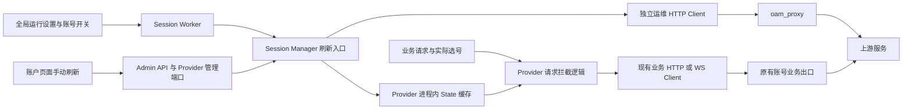

# 会话保活与 State 热更新设计草案

本文是待实施的设计与分步开发说明，不代表当前版本已提供该能力。本轮只交付文档；后续按 Step 1 至 Step 5 逐步实施，每一步完成后等待用户确认。

## 1. 目标与证据边界

目标是通过独立运维出口获取上游 State，并在符合协议约束时供业务请求复用，减少 State 失效引起的请求失败。运维探活与业务转发使用独立 HTTP Client、连接池及代理配置。

目前尚未提供失败请求的脱敏证据、发生版本或对应官方源码，不能确认“凭证频繁过期”一定由 State 引起，也不能确认心跳能够消除限流。OAuth access token、refresh token 与 `x-codex-turn-state` 必须区分；本功能不替代已有 OAuth 刷新和额度管理。

已核对的本项目实现：

| 位置 | 当前事实及设计影响 |
| --- | --- |
| `backend/crates/providers/openai/src/provider/mod.rs`，`same_client_turn` 调用处 | 已有 State 恢复逻辑只在相同客户端轮次内复用；按账号与模型覆盖其他轮次需要额外依据。 |
| `backend/crates/gateway-core/src/engine/mod.rs`，`ProviderAccountStateOwner` | 不透明状态绑定创建它的 Provider 与账号，不能在换号后沿用。 |
| `backend/crates/providers/openai/src/transport/response_meta.rs` | 已有 `x-codex-turn-state` 响应头提取能力，后续应复用解析规则。 |
| `backend/crates/providers/openai/src/transport/websocket/exchange/reducer.rs` | WS 还会从响应 metadata 提取 State，HTTP Header 并非所有传输的唯一来源。 |
| `backend/crates/providers/openai/src/transport/client.rs` | 业务 HTTP Client 按账号出口缓存，已有独立代理与连接池规则。 |
| `backend/crates/providers/openai/src/provider/workers.rs` | Provider 贡献 Worker，Host 负责监督和关闭。 |
| `backend/crates/gateway-store/src/postgres/runtime_settings.rs` | 全局运行设置由 PostgreSQL 单例持久化。 |

实施 Step 2 前，应核对适用版本的官方请求源码与脱敏运行证据，确认合法模型 ID、探活响应是否提供 State、State 是否绑定轮次、会话、凭据版本或网络出口。特别要验证从运维出口取得的 State 能否在业务出口使用。实施 Step 4 前，必须确认跨会话覆盖符合上游合同；若不符合，应调整设计，不能绕开已有轮次隔离。

60 分钟 TTL 是本地缓存策略，并非已证实的上游有效期。后续若上游给出更短期限，采用更早的失效时间。

用户已明确：每个账号、每个模型的有效 `x-codex-turn-state` 均不一致。因此账号与模型是缓存隔离的必要维度，禁止只按账号、只按模型或使用全局单值缓存。这一要求不等同于已经确认同一账号、同一模型下可以跨会话或跨轮次复用。

## 2. 模块与网络边界

Session Manager 归属 OpenAI Provider，独立叶子文件拟为 `backend/crates/providers/openai/src/session_manager.rs`。使用私有模块，不新增 Core 对具体 Provider 或 HTTP 的依赖。



约束：

- 运维 Client 必须独立构造，不能克隆业务 Client 或进入现有业务 Client 缓存。只从 `oam_proxy` 选择代理，禁止回退到直连、环境代理或账号业务代理。
- `oam_proxy` 为空时停止探活；格式错误或连接失败时报告脱敏错误，不改变业务出口。
- 按需求，忽略 TLS 证书校验仅作用于运维 Client，不能修改业务 Client 的证书策略。独立代理必须属于可信运维边界；该设置意味着运维链路失去证书真实性校验。
- 独立 Client 和代理只能保证应用层出口与连接池隔离。实际网络是否走不同出口，需要部署侧路由及双代理运行证据确认。
- Middleware 位于 Provider 实际选号之后、发送之前。入站 HTTP 中间件尚不知道最终账号，不应信任客户端提供的账号 ID。
- 业务热路径只读内存，不同步发起探活，不等待运维网络。缓存未命中、失效或功能关闭时沿用现有处理。
- Worker 通过现有 Bundle 向 Host 注册，复用取消与关闭机制，不使用无人监督的独立任务。

## 3. Step 1：配置与数据结构

### 3.1 全局运行配置

将 `oam_proxy: String` 加入现有全局 `RuntimeSettings`，默认值为空字符串。该设置供所有开启保活的 OpenAI 账号共用。

这里的“全局配置”采用现有 PostgreSQL 运行设置，不在启动 YAML 中另建第二份同名权威配置。这样 Step 5 可直接沿用现有设置管理与 revision 发布机制。

读取模型保存 `String`；内部更新命令采用 `Option<String>` 表达兼容语义：`None` 保留当前值，`Some("")` 显式关闭，非空值设置代理。已有管理接口在 Step 1 中不接收新字段，内部映射传入 `None`，避免保存其他设置时清空该字段。实际 HTTP 字段与代理校验在 Step 5 接入。

代理 URL 可能包含认证信息。包含该字段的结构必须使用脱敏 `Debug`，审计只记录字段发生变化，不记录 URL 原文；异常也不得包含代理认证信息。

### 3.2 账号模型

在 `ProviderAccount` 增加私有布尔字段 `enable_session_keepalive`，通过现有构造器默认设为 `false`，提供只读 getter 与构造映射所需的方法。同步 Store 行模型和 Admin 账号投影，保证重载后仍是数据库中的值。

存量账号与新建账号均默认关闭。重新导入、刷新凭据或修改其他属性不得意外关闭已有开关。Step 1 只建立模型及持久化基础，不开放 HTTP 切换入口。后续更新命令用 `Option<bool>` 区分“未提交”与“显式关闭”。

### 3.3 数据库迁移草案

当前迁移最大编号为 `0015`，计划新增 `0016_session_keepalive.sql`；实际实施前重新确认编号。已有迁移不修改，新迁移登记到 `.frozen-sha256`。

```sql
ALTER TABLE runtime_settings
    ADD COLUMN oam_proxy TEXT NOT NULL DEFAULT '';

ALTER TABLE provider_accounts
    ADD COLUMN enable_session_keepalive BOOLEAN NOT NULL DEFAULT FALSE;
```

Step 1 必须同步相关 SELECT、行解码、领域映射及设置更新逻辑，不能只给 Rust 结构体添加字段而遗漏数据库读取。现有账号更新和导入 SQL 对新列保持原值；新记录使用数据库默认值。

### 3.4 内存缓存草案

使用已有 Tokio 依赖提供的 `RwLock`，不新增 DashMap 依赖。Provider 初始化时构造一个缓存实例，后续供后台刷新、手动刷新和请求拦截逻辑共享；不使用独立的进程静态可变单例。

以下为 Step 1 的类型草案，尚未写入 Rust 源文件或执行编译验证：

```rust
use std::{collections::HashMap, sync::Arc};

use tokio::sync::RwLock;

// 保留需求指定的精确名称；接入上游前需核实真实模型 ID。
pub(crate) const KEEPALIVE_MODELS: [&str; 2] = ["5.6 sol", "6"];

#[derive(Clone)]
pub(crate) struct SessionState {
    pub(crate) state_value: String,
    // Unix 时间戳，单位为秒；等于当前时间时即失效。
    pub(crate) expire_at: i64,
}

#[derive(Clone, Default)]
pub(crate) struct SessionStateCache {
    entries: Arc<RwLock<HashMap<String, SessionState>>>,
}
```

不派生可输出 State 的 `Debug`，不为缓存提供 API 序列化。读写通过模块方法封装，锁只覆盖内存访问，不在持锁期间执行网络、数据库或休眠操作。

| 项目 | 合同 |
| --- | --- |
| Key | `format!("{account_id}:{model_name}")`。账号使用系统最终选定的账号 ID，模型严格匹配，不 trim、不改大小写、不做模糊匹配。 |
| Value | `SessionState { state_value: String, expire_at: i64 }`。State 视为不透明值。 |
| 有效条件 | `expire_at > now`。为空或不能作为合法请求头的 State 不写入。 |
| TTL | 成功取得 State 后记录当前时间，再加 3600 秒；失败不能延长旧值 TTL。 |
| 生命周期 | 内存可重建，不落盘。进程重启为空缓存，业务回退到现有行为。 |
| 容量 | 每个符合条件的账号最多两个模型条目；后续 Worker 清理过期、删除和关闭账号条目。 |

例如，`account-a:5.6 sol`、`account-a:6`、`account-b:5.6 sol`、`account-b:6` 是四个独立条目。刷新其中一个不能覆盖其余三个；精确 Key 未命中时沿用现有请求处理，绝不借用其他账号或模型的 State。一个模型探活失败，不删除另一个模型仍有效的条目，也不延长失败模型旧条目的有效期。

需求中的 `5.6 sol`、`6` 与当前源码定价表中的 `gpt-5.6-sol`、`gpt-6-astra` 不同。定价表也不能证明某个账号当前可调用哪些模型。Step 1 原样保留需求名称；Step 2 前核对真实请求与官方目录，不自行替换。若使用全局模型映射，探活与注入必须采用同一最终上游模型口径，先明确其与上述精确名称的关系。

现有 Key/Value 没有编码 credential revision 或轮次，不能单凭它证明跨会话可复用。后续必须在写入和读取边界校验账号身份、凭据 revision、开关及相关配置代次；失效后还要拒绝正在飞行的旧探活结果重新写入。是否需扩展缓存元数据，取决于上游合同核验结果，不能只清空缓存就声称消除了竞态。

### 3.5 预计修改或新增的文件

以下是 Step 1 的实施清单，不是本轮实际修改清单。同步构造点和测试 fixture 的最终范围以编译及调用链核对为准。

| 路径（相对仓库根目录） | 工作 |
| --- | --- |
| `backend/migrations/0016_session_keepalive.sql`（新增） | 增加两个字段及默认值。 |
| `backend/migrations/.frozen-sha256` | 登记新迁移摘要。 |
| `backend/crates/gateway-admin/src/model/settings.rs` | 全局配置读取字段、内部更新语义与脱敏。 |
| `backend/crates/gateway-store/src/postgres/runtime_settings.rs` | Store 模型、SQL 读取/更新、解码及脱敏。 |
| `backend/crates/gateway-store/src/admin_adapter.rs` | 设置读写映射，旧调用保留新字段。 |
| `backend/crates/gateway-core/src/account/model.rs` | 账号字段、默认值和访问方法。 |
| `backend/crates/gateway-admin/src/model/accounts.rs` | 账号读取投影。 |
| `backend/crates/gateway-store/src/postgres/provider_accounts/rows.rs` | 账号行结构、查询及 Core 映射。 |
| `backend/crates/gateway-store/src/postgres/provider_accounts/repository.rs` | 核对独立查询、创建和导入保留语义，补齐必要读取。 |
| `backend/crates/gateway-store/src/postgres/provider_accounts/mapping.rs` | Admin 账号映射。 |
| `backend/crates/providers/openai/src/session_manager.rs`（新增） | State、缓存类型及精确模型常量。 |
| `backend/crates/providers/openai/src/lib.rs` | 私有模块声明；共享实例在消费方接入时装配。 |
| `backend/crates/gateway-api/src/admin/settings.rs` | 仅适配内部命令构造，传入保留值；新 HTTP 字段仍留到 Step 5。 |
| 对应 crate 的镜像 `tests/` 目录 | 默认值、持久化与旧调用保留语义，以及受影响 fixture。 |

Step 1 不创建心跳 Client，不注册 Worker，不修改转发请求头，不开放新 API 字段。缓存的读写行为随 Step 3/4 消费方接入，避免在本阶段实现未使用的调度或协议逻辑。

### 3.6 Step 1 验收

- 迁移后存量账号开关为 `false`、全局代理为空；新建账号行为相同。
- 数据库中非默认值能够正确读取；保存其他设置、账号更新和凭据轮换不覆盖它们。
- 日志、错误、Debug 和审计不输出代理认证或 State。
- 默认配置不启动网络活动，不改变当前业务链路。
- 在缓存读写接入阶段验证同账号不同模型、不同账号同模型及不同账号不同模型均隔离；未命中时不存在跨 Key 回退。
- 按 [架构验收入口](architecture.md#12-修改与验收) 执行格式、Clippy、相关测试与架构检查，并验证迁移冻结清单。数据库测试需要专用测试库，因环境缺失而跳过不能计为通过。

## 4. 后续步骤与交付边界

| 步骤 | 计划行为 | 必须提供的验证 |
| --- | --- | --- |
| Step 2：Heartbeat Client | 核对官方协议后，用独立代理 Client 和当前真实账号鉴权发送合法轻量请求，Prompt 为 `hi`，提取有效 State。缺失 State、非成功响应、超时均返回错误。复用现有身份与协议规则，设置有界超时并禁止自动重定向。 | 真实模型 ID、Header/metadata 来源、无 State/401/429/超时路径，以及独立代理命中证据。 |
| Step 3：Worker | 筛选已启用、凭据可用且开关开启的受支持 OpenAI 账号，对两个已核实模型逐一探活，成功后更新缓存。每轮结束均匀抽取闭区间 `3000..=3480` 秒并可取消地休眠。 | 两模型独立成功/失败、TTL、关闭与轮换竞态、取消退出、无账号及配置变化。 |
| Step 4：请求拦截 | 在实际选号、现有账号状态隔离完成后及最终 Header 构造前，由 Session Manager 执行缓存查找；仅对开关开启且模型精确命中的请求注入有效 State。业务仍由原有 transport 发送。 | 开关关闭、其他模型、缓存失效、换号、原生续写、HTTP/WS 及重试路径；双代理观测确认出口隔离。 |
| Step 5：管理 API 与账户页面 | 扩展现有全局设置与账号接口，wire 沿用 camelCase，即 `oamProxy` 与 `enableSessionKeepalive`；复用 Admin 鉴权、持久化、审计和配置发布。增加手动刷新接口及账户页面入口，复用 Session Manager 刷新能力。 | 保存/读取、非法代理、旧客户端遗漏字段保留值、重启后保留、启停及时生效、敏感字段保护，以及手动刷新的接口与浏览器交互验收。 |

Step 3 的轮间 jitter 只能打散周期，不能消除进程启动时或单轮内大量并发请求。首版采用顺序或有界并发，尊重上游 `Retry-After`，不创建无界任务。若一轮耗时加休眠超过 60 分钟，早期缓存可能过期，此时允许按现有业务路径继续，不能延长旧 State 有效期来掩盖缺口。

探活是真实上游调用，可能产生费用、占用额度。独立网络连接池不等于独立账号额度；需记录脱敏运维结果与可取得的用量，不把探活伪装为用户请求，也不能擅自将未知费用记为零。

WS 复用连接时，新的 HTTP Header 不会随每一帧重发。Step 4 必须依据官方合同明确握手 Header 与逐帧 metadata 的注入规则；不能仅修改 HTTP Header 后宣称 WS 热更新已覆盖。

Step 5 中读取含认证的 `oamProxy` 属于敏感管理合同，不能进入普通诊断导出。实现字段读取与保存时同时明确脱敏展示和原值保留方式。

### 4.1 账户页面手动刷新 State

账号开启 `enable_session_keepalive` 后，在账户页面该账号的操作区提供“刷新 State”。点击后立即发起该账号两个目标模型的刷新，不等待下一轮后台调度。此操作与现有“刷新 Token”“刷新额度”使用不同名称和入口。

- **可用条件**：仅对支持该能力且已开启保活的账号展示。账号被禁用、运维代理未配置或该账号正在刷新时，按钮不可用并说明原因；服务端同样检查条件，不能只依赖前端限制。
- **统一实现**：管理请求经过 API → Admin → Provider 管理端口调用 Session Manager。手动和自动刷新复用相同的鉴权、运维 Client、模型选择、缓存写入及失效检查，不维护两份探活逻辑。
- **刷新范围**：一次点击刷新该账号的两个目标模型，分别更新 `{account_id}:{model_name}`。成功项从本次取得 State 的时间起计算 TTL；失败项保留仍有效的旧值，不延长其有效期。
- **并发控制**：手动和后台任务按账号共享刷新互斥。同账号已有刷新时，返回明确的“刷新中”结果，不再发起重复探活。前端按账号显示 loading 并防止重复点击；不同账号仍受全局探活并发上限约束。
- **结果反馈**：分别展示两个模型的成功或失败、刷新时间和成功后的到期时间；支持“部分成功”，不以一个模型成功代表全部成功。不向浏览器返回 State 原文、账号 Token 或代理认证信息。
- **调度关系**：手动刷新不重置整个 Worker 的随机周期，不影响其他账号。刷新过程中关闭保活、删除账号或轮换凭据时，旧请求的结果不得重新写入缓存。

拟沿用现有账号动作接口风格，新增 `POST /api/admin/accounts/session-state/refresh`，请求体为 `{ "accountId": "<账号 ID>" }`，使用现有管理员鉴权与响应封装。响应包含逐模型结果及脱敏错误，不能把仅已受理或正在刷新表示为刷新成功。端点名称和状态码在 Step 5 中落实到 API 文档。

Step 2/3 建立可供手动调用的共用刷新能力；接口和页面在 Step 5 交付，不扩大 Step 1 的代码范围。预计涉及 `gateway-admin` 的 Provider 管理端口与账号用例、`gateway-api/src/admin/accounts/`、OpenAI Provider 管理适配器，以及 `frontend/src/api/modules/accounts.ts`、账户页面及其操作组件/composable。

验收覆盖：关闭时无入口、开启后可点击、代理缺失提示、双模型成功、部分失败、全部失败、重复点击、与后台刷新重叠、刷新中关闭开关，以及业务出口不变。前端复用现有基础组件与主题，在浏览器验证 loading、结果展示和窄窗口布局。

## 5. 当前交付状态

当前仅完成设计文档，尚未实施 Rust、数据库迁移、API 或页面变更。源码核对基线为仓库 `main` 的 `3328a4356a4f1d2c448e5e16ab5e120f37498999`（v3.10.0）。未进行真实上游探活、官方源码版本核验、Rust 编译或数据库测试，上述示例与计划不构成运行验证结果。
